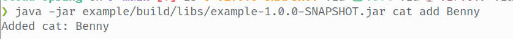
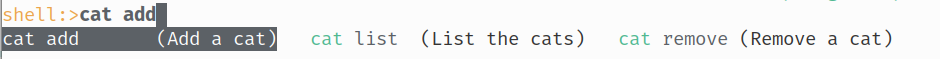
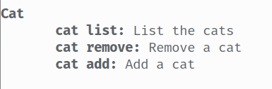
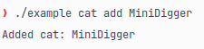

 
<h1>cloud-spring</h1>

This is an opinionated implementation of [Cloud](https://github.com/incendo/cloud) for 
[Spring Shell](https://spring.io/projects/spring-shell).
Cloud for Spring maps to a quite small subset of the Spring Shell features and does not aim to be a replacement
for working with spring-shell.
Rather, it's a way to use a familiar command framework to quickly & easily create commands for your Spring application.

Spring Shell uses "options" (what Cloud would call flags) for input, which Cloud does not do.
We therefore map all arguments to an array of strings, which means that we get access to (nearly) all Cloud features.

The example module contains a Spring Boot application with a couple of commands.

## features

- auto-discovery of `CommandBean` instances as well as `@ScanCommands`-annotated classes
- supports both interactive & non-interactive (CLI) commands

- support for Spring Shell features such as descriptions and command groups

- configurable by overriding the bean bindings
- completions!

- support for native builds

## limitations

- no intermediate executors (you can do `/cat add` and `/cat remove` but not `/cat`)

## links

- Docs: https://cloud.incendo.org/spring/
- Incendo Discord: https://discord.gg/aykZu32
